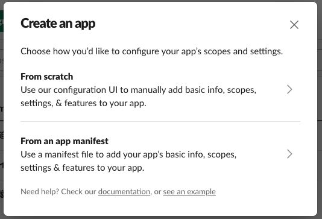
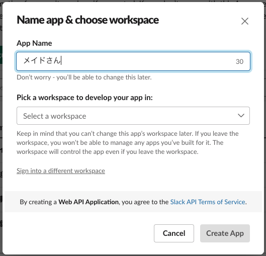
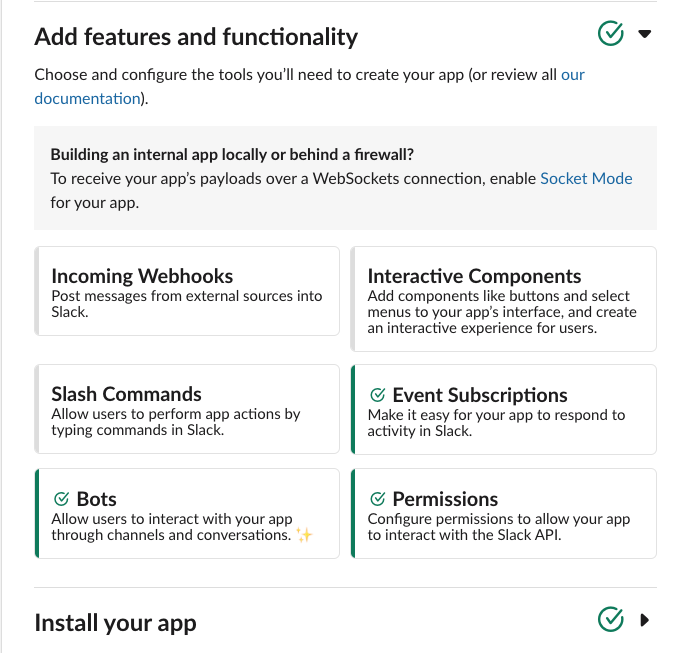
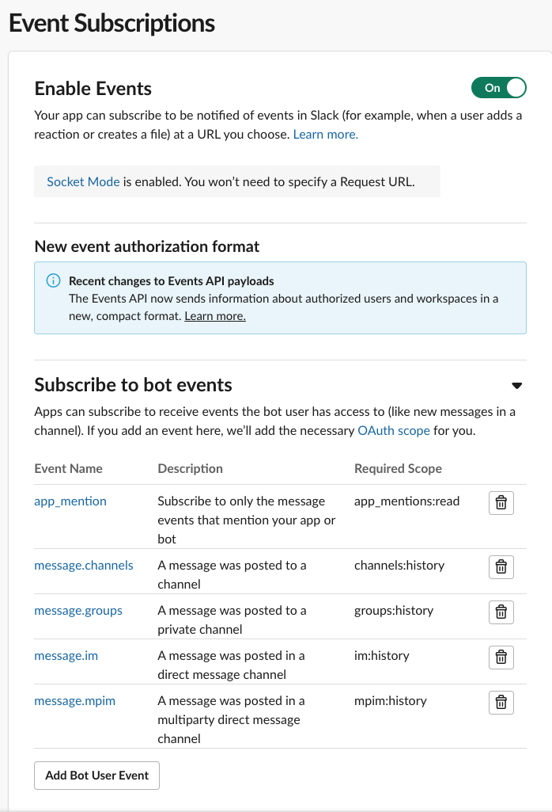
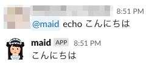

# Boltでローカル支援botを作る

## はじめに

作業していると自動化したいなということが多々あります。過去いろいろ作って試していたのですが、管理が分散化してしまい使わなくなったものもあります。そこでまとめて管理するためにローカル環境にbotを常駐化させて1本化を試みました。

botにやってもらっていることは簡単で主に CronJob で作業を一定の日時に行ってもらってます。それだけでもいいのですが、Slack を介して一定の作業をしたいことがあったのでBoltを採用しました。

## 環境

- Mac
- ターミナル
- Slack
- Node.js v20.6.0
- npm 9.8.1

## Node.js の環境構築

まずは Node.js をインストールします。今回は Homebrew を利用してインストールします。

```sh
brew install node
```

`nodebrew` を利用したバージョン管理等は好き勝手してください。

次に `package.json` を作ります。

```sh
npm init -y
```

これで Node.js を扱う下準備が完了しました。`package.json` の中身については詳しく解説しませんが、例として以下に載せておきます。

```json:package.json
{
  "name": "bot",
  "version": "1.0.0",
  "description": "",
  "main": "index.js",
  "scripts": {
    "test": "echo \"Error: no test specified\" && exit 1"
  },
  "keywords": [],
  "author": "",
  "license": "ISC"
}
```

## CronJob のインストール

Node.js には様々な schedulers が存在します。

- [node-schedule](https://github.com/node-schedule/node-schedule)
- [node-cron](https://github.com/node-cron/node-cron)
- [cron](https://github.com/kelektiv/node-cron)

他にも高機能なものがたくさんあります。

違いは様々ありあますがそれは以下のような別記事を参考にしてください。

[Comparing the best Node\.js schedulers \- LogRocket Blog](https://blog.logrocket.com/comparing-best-node-js-schedulers/)

今回は、`cron` を使います。

以下のコマンドでインストールします。

```sh
npm i -s cron
```

すると、`node_modules` が生成され、 `package.json` が以下のようになります。
`node_modules` は `.gitignore` に追加して管理外にしておきましょう。

```diff:package.json
{
  "name": "bot",
  "version": "1.0.0",
  "description": "",
  "main": "index.js",
  "scripts": {
    "test": "echo \"Error: no test specified\" && exit 1"
  },
  "keywords": [],
  "author": "",
  "license": "ISC",
  "dependencies": {
+    "cron": "^3.1.6"
  }
}
```

上記のように `dependencies` に `cron` が追加されます。

`package-lock.json` も生成されますが、今回は気にする必要はないのでそっとしておきます。

## Bolt のインストール

以下のコマンドを実行します。

```sh
npm i -s @slack/bolt
```

`package.json` が以下のようになります。

```diff:package.json
{
  "name": "bot",
  "version": "1.0.0",
  "description": "",
  "main": "index.js",
  "scripts": {
    "test": "echo \"Error: no test specified\" && exit 1"
  },
  "keywords": [],
  "author": "",
  "license": "ISC",
  "dependencies": {
    "cron": "^3.1.6",
+    "@slack/bolt": "^3.15.0"
  }
}
```

先程と同じように `dependencies` に `@slack/bolt` が追加されます。

## 環境変数

Slack を利用するのでBot用のトークンを生成します。

### Slack のホームページへアクセス

<https://api.slack.com/apps>

Slack APIのページに行き、**Create New App**ボタンを押します。
そしたら選択肢が出てきます。



**From scratch**を選択します。



App Name に好きな名前を設定し、自分の所属しているワークスペースを選択します。

アプリが生成されたら**Add features and functionality**の項目を開いて、
**Event Subscriptions**をクリックします。



今回はSocket Modeを利用するのでEvent Subscriptionsは以下のように設定しています。



画像は力尽きました。以降は簡単な箇条書きにてお送りします。

### 必要なトークン

以下の通りです。

- App Credentials で**Signing Secret**を利用します。
- OAuth & Permissions で、**Bot User OAuth Token**を生成します。
- App-Level Tokensで**App Token**を生成します。

Scopeは必要なものを適宜設定してください。

`app_mentions:read`とかは必須かな。

### 環境変数の設置

今回は `.env` ファイルを作成して `set -a; source .env; set +a; node index.js` といった感じで実行します。

```sh:.env
SLACK_SIGNING_SECRET=(Signing Secret)
SLACK_BOT_TOKEN=(Bot User OAuth Token)
SLACK_APP_TOKEN=(App Token)
```

`.env` を世間に晒してしまうのは危険なので `.gitignore` に追記します。

## index.js の作成

`index.js` という名前のファイルを作成します。
各種環境変数を設定し、以下のように記述すると起動できます。

```js:index.js
const { App } = require('@slack/bolt');

const app = new App({
    token: process.env.SLACK_BOT_TOKEN,
    signingSecret: process.env.SLACK_SIGNING_SECRET,
    socketMode: true,
    appToken: process.env.SLACK_APP_TOKEN,
    port: process.env.PORT || 3000
});

(async () => {
    await app.start();
    console.log('⚡️ Bolt app is running!');
})();
```

これで基本的なコードは書き終わりました。

## Slackのメッセージに反応させる

リプライしたときに反応して欲しいので、`app_mention` イベントに対応できるようにします。今回は簡単にオウム返しするものを実装しています。

```diff_javascript:index.js
const { App } = require('@slack/bolt');

const app = new App({
    token: process.env.SLACK_BOT_TOKEN,
    signingSecret: process.env.SLACK_SIGNING_SECRET,
    socketMode: true,
    appToken: process.env.SLACK_APP_TOKEN,
    port: process.env.PORT || 3000
});

+ // 疎通確認
+ app.message(/ping/i, async ({ message, say }) => {
+     await say('pong');
+ });
+ 
+ // オウム返し
+ app.event('app_mention', async ({ event, say }) => {
+     let matches = event.text.match(/echo (.*)/i);
+     if (matches) {
+         await say(`<@${event.user}> ${matches[1]}`);
+         return;
+     } else {
+         await say(`<@${event.user}> そういうのはやってないです`);
+     }
+ });

(async () => {
    await app.start();
    console.log('⚡️ Bolt app is running!');
})();
```

## 環境変数を反映して実行する

`package.json` の `scripts` を以下のように変更します。

```diff:package.json
{
  "name": "bot",
  "version": "1.0.0",
  "description": "",
  "main": "index.js",
  "scripts": {
-    "test": "echo \"Error: no test specified\" && exit 1"
+    "start": "set -a; source .env; set +a; node index.js"
  },
  "keywords": [],
  "author": "",
  "license": "ISC",
  "dependencies": {
    "cron": "^3.1.6",
    "@slack/bolt": "^3.15.0"
  }
}
```

## 実行

以下のコマンドで実行できます。

```sh
npm start
```


## リプライ

動作チェックをします。

Slack で bot に対してリプライしてみましょう。




`echo` をつけ忘れると塩対応になります。


正常に動作しました。

## CronJob でリマインダー

今回は仕事が終わる時間(19時)にTwitterを開くよう設定してみました。

個人的な環境では Google カレンダーの API で当日の予定を取得して、location がURLの場合に開くようにしています。

```diff_javascript:index.js
const { App } = require('@slack/bolt');
+ const open = require('open');
+ const CronJob = require('cron').CronJob;

const app = new App({
    token: process.env.SLACK_BOT_TOKEN,
    signingSecret: process.env.SLACK_SIGNING_SECRET,
    socketMode: true,
    appToken: process.env.SLACK_APP_TOKEN,
    port: process.env.PORT || 3000
});

// 疎通確認
app.message(/ping/i, async ({ message, say }) => {
    await say('pong');
});

// オウム返し
app.event('app_mention', async ({ event, say }) => {
    let matches = event.text.match(/echo (.*)/i);
    if (matches) {
        await say(`<@${event.user}> ${matches[1]}`);
        return;
    } else {
        await say(`<@${event.user}> そういうのはやってないです`);
    }
});

+ new CronJob('0 0 19 * * *', async () => {
+     await open("https://twitter.com/home");
+ }, null, true, 'Asia/Tokyo');

(async () => {
    await app.start();
    console.log('⚡️ Bolt app is running!');
})();
```

これで19時にTwitterが開くようになりました。

## URLを開く

今回はMac環境を想定していますが、一応マルチプラットフォームでURLを開く場合について記載しておきます。

### child_process の exec を使う方法

ライブラリを利用しない方法でシェルコマンドを使う方法があります。

```js
const { exec } = require('child_process')
const url = "https://qiita.com/";
exec(`open ${url}`, (err, stdout, stderr) => {
    if (err) {
      console.log(`stderr: ${stderr}`)
      return
    }
    console.log(`stdout: ${stdout}`)
  }
)
```

ただ、環境に依存するためこれをおすすめすることは避けたいです。そこでライブラリを利用します。

### open

<https://github.com/sindresorhus/open>

このライブラリはクロスプラットフォームでURL、ファイル、実行可能ファイルなどを開くことができます。ただし、最新バージョンではESMのみの対応とそのまま利用することができなくなっているので少し古いバージョンを利用します。ESMで書いてる人は最新バージョンを利用すると良さそうです。

```sh
npm i -s open@8.4.2
```

```diff:package.json
{
  "name": "bot",
  "version": "1.0.0",
  "description": "",
  "main": "index.js",
  "scripts": {
    "start": "set -a; source .env; set +a; node index.js"
  },
  "keywords": [],
  "author": "",
  "license": "ISC",
  "dependencies": {
    "@slack/bolt": "^3.15.0",
    "cron": "^3.1.6",
+    "open": "^8.4.2"
  }
}
```

これで、簡単に開くことができるようになりました。

#### 試しに使ってみる

`test.js` ファイルを作成して以下のコードを貼り付けて、`node test.js` を実行します。
すると10秒後にQiitaが開きます。

```js:test.js
let date = new Date();
date.setSeconds(date.getSeconds() + 10);
new CronJob(date, async () => {
    await open("https://qiita.com/");
}, null, true, 'Asia/Tokyo');
```

他にもローカルであればファイルを開いたりも可能なので色々試してみてください。

```js
await open("/Applications/Slack.app");
```

例えば上記を実行するとSlackが開きます。

#### 試しに組み込んでみる

次はSlack の `app_mention` で使ってみます。

```js:index.js
app.event('app_mention', async ({ event, say }) => {
    let matches2 = event.text.match(/open <(https?:\/\/.*)>/i);
    if (matches2) {
        await open(matches[1]);
        return;
    } else {
        await say(`<@${event.user}> そういうのはやってないです`);
    }
});
```

`@maid open https://qiita.com/` を実行すると Qiita のサイトを開いてくれます。

## おわりに

今回はBoltを利用したローカル支援botを紹介しました。
Slackで反応したり、URLを開いたり、アプリを起動したりするだけですが結構便利に動いてくれるのでおすすめです。
他にも色々な機能を詰め込んでいるのですが、書ききれる自身がないのでここまでとしています。

:::note
**最後に宣伝です。**

Supershipではプロダクト開発やサービス開発に関わる人を絶賛募集しております。
ご興味がある方は以下リンクよりご確認ください。
[Supership 採用サイト](https://supership.jp/recruit/)
是非ともよろしくお願いします。
:::

## コード

今回実装したコードを以下に載せておきます。

```json:package.json
{
  "name": "bot",
  "version": "1.0.0",
  "description": "",
  "main": "index.js",
  "scripts": {
    "start": "set -a; source .env; set +a; node index.js"
  },
  "keywords": [],
  "author": "",
  "license": "ISC",
  "dependencies": {
    "@slack/bolt": "^3.15.0",
    "cron": "^3.1.6",
    "open": "^8.4.2"
  }
}
```

```js:index.js
const { App } = require('@slack/bolt');
const open = require('open');
const CronJob = require('cron').CronJob;

const app = new App({
    token: process.env.SLACK_BOT_TOKEN,
    signingSecret: process.env.SLACK_SIGNING_SECRET,
    socketMode: true,
    appToken: process.env.SLACK_APP_TOKEN,
    port: process.env.PORT || 3000
});

// 疎通確認
app.message(/ping/i, async ({ message, say }) => {
    await say('pong');
});

// オウム返し
app.event('app_mention', async ({ event, say }) => {
    let matches = event.text.match(/echo (.*)/i);
    let matches2 = event.text.match(/open <(https?:\/\/.*)>/i);
    if (matches) {
        await say(`<@${event.user}> ${matches[1]}`);
        return;
    } else if (matches2) {
        await open(matches2[1]);
        return;
    } else {
        await say(`<@${event.user}> そういうのはやってないです`);
    }
});

new CronJob('0 0 19 * * *', async () => {
    await open("https://twitter.com/home");
}, null, true, 'Asia/Tokyo');

(async () => {
    await app.start();
    console.log('⚡️ Bolt app is running!');
})();
```
